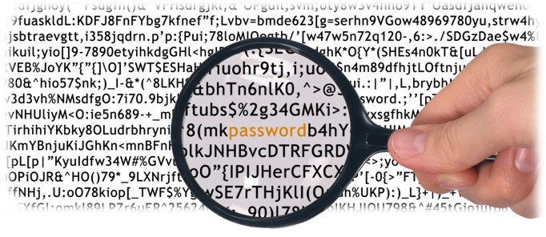
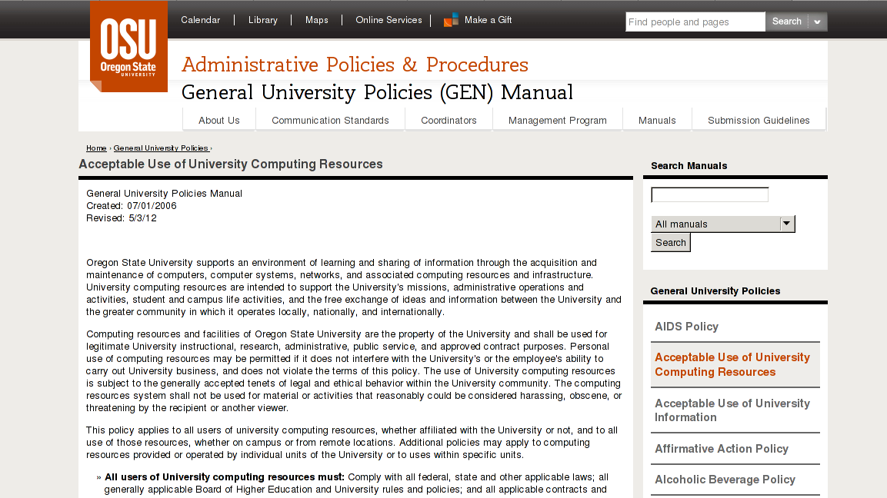
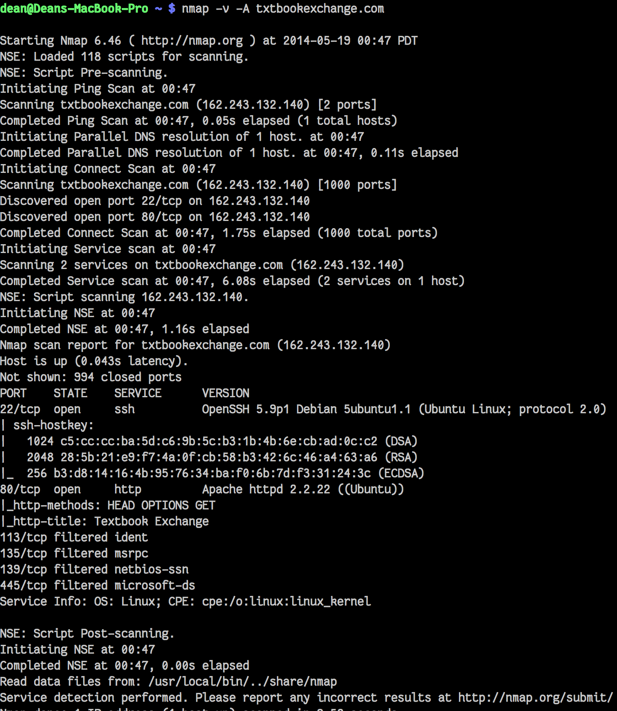
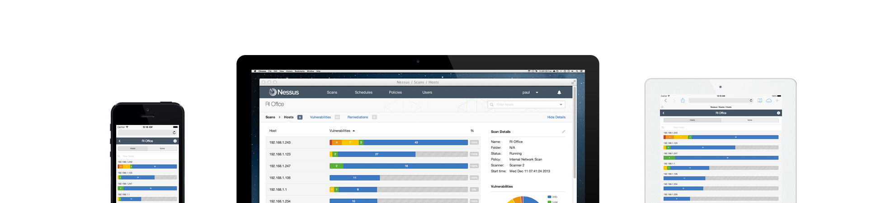

==========
Pentesting
==========

What's pentesting? 
==================

.. note:: emily

* Legally searching a system for security vulnerabilities

.. figure:: _static/whitehat_blackhat.jpg
    :align: center

.. note:: Penetration Testing -- Find prospective vulnerabilities and then
    verify that an attacker could exploit them
    
    Includes automatic or manual vulnerability scans plus other techniques

    * Targeted testing -- whitebox, cooperative with internal teams
    * External testing -- Done from outside the network
        * Misses what if attacker is a company insider
        * How far could a malicious external party break in?
    * Internal testing -- Simulate disgruntled employee w/ standard access
        * Disgruntled sysadmin? You're out of luck
    * Blind testing -- black-box
        * Only have company name + any tech blogs / logs about infra
    * Double Blind testing -- most of company isn't aware of test
        * Makes social engineering techniques more effective

    (from http://searchsoftwarequality.techtarget.com/definition/penetration-testing) 

Getting into the industry
=========================

.. note:: Dean. Getting into the pen-testing / the computer security focused 
          industry is not too difficult. It used to be that many 'hackers'
          as portrayed by the media were black-hat, and often got into the
          industry by breaking systems without permission. Since then,
          there have been many improvements to our current systems of 
          reporting bugs without getting in trouble, such as bug bounties.
          This allows people to try and find security vulnerabilities in 
          applications such as Facebook, Google, etc. and report them for
          a monetary reward. Before, people may try and break systems and
          instead of being rewarded, be attacked by the industry for finding
          the bugs without permission in the first place. Other ways of getting
          into industry are getting certifications, proving you know what
          you're doing. However, getting real clients, or getting involved with
          a good consulting company usually requires more than just certification;
          experience is the most valuable.

.. figure:: _static/hacker.jpg
    :align: center
    :scale: 50%

* Often background in black-hat work
* Certifications/degrees can help; experience counts most
* CTFs
* Bug bounties

Pentesting Clients
==================

.. note:: emily

* Anyone whose systems might be attacked
    * Banking
    * e-commerce
    * Governments
    * Corporations
    * Military

.. note:: Anyone who has a large software deployment in the wild and might
    face malicious intruders needs it

    Any company building/selling product with security claims, ie firewall
    or operating system code, also needs to audit and rigorously test
    deployments of their product

    Also open source projects related to network security (ie Tomato the
    router firmware) really ought to pentest themselves.

How can pentesting be done legally?
===================================

.. note:: dean
          Check with site owners, or look for a bug bounty program.
          Check acceptable use poliicies!! Do not want to get in trouble for
          not reading the fine print. 
          When reporting issues, be sure to thoroughly explain your processes.
          1. Explanation of what the bug is.
          2. Give a clear definition of the steps to repeat to make the bug
             happen again.
          3. Explain what the meaning of the bug is. How can it compromise a
             a system.
          4. Explain ways to fix the bug. 

          Most of all, be sure to disclose the bug to the company first,
          and give ample time for the company to respond to your original
          disclosure before disclosing the bug to public (especially if it
          discloses sensitive information).

* Contract with owner of system
    * Legal consent to find vulnerabilities
    * Clear explanation of what may be done with discovered problems
    * Avoid breaking laws about disclosing sensitive data
* Some companies offer bug bounties, reporting programs

Acceptable Use Policies
=======================

.. note:: emily

**Authorized Use**

Tools & Techniques
==================

Metasploit
----------

.. note:: emily

* Metasploit framework
* Free & Open Source
* Includes anti-forensic and evasion tools
* Choose exploit, encoding, and payload, then execute
  
.. figure:: _static/metasploit_logo.png
    :align: center

nmap (pt 1)
----

.. note:: Dean, with example. nmap is a very powerful tool. Most of the
          features it provides help assess the vulnerability of networks.
          Some of these include:
          1. What computers did you find running on the local network?
          2. What IP addresses did you find running on the local network?
          3. What is the operating system of your target machine?
          4. Find out what ports are open on the machine that you just scanned?
          5. Find out if the system is infected with malware or virus.
          6. Search for unauthorized servers or network service on your network.
          7. Find and remove computers which don't meet the organization's minimum level of security.

* Network sweeps
* network tracing
* port scans
* OS fingerprinting
* version scans
* vulnerability scans

nmap (screenshot)
-----------------

Nessus
------

.. note:: dean 

* Proprietary, integrated vulnerability scanner
* 2.2.11 and before were GPL
* Misconfiguration, DoS with mangled packets, default passwords, PCI DSS audit
    * (Payment Card Industry Data Security Standard)

Wireshark
---------

.. note:: dean

* Unsecured access points

Social engineering
------------------

.. note:: emily

* Pretexting
* Phishing
* Baiting
    * Stuxnet
* Quid pro quo
* Tailgaiting

Vulnerabilities
===============

.. note:: Dean: We have discussed many of these previously, but here is another
          recap of what each of the exploits are and how to exploit them.

* SQL injection
* XSS
* JS injection

Privilege escalation
--------------------

.. note:: emily

Known, unpatched vulnerabilities
--------------------------------

.. note:: dean, & focusing on networking hardware / routers.
          

* OS vulnerabilities
* Web server vulnerabilities
* Web development frameworks

Clueless (l)Users
-----------------

.. note:: emily

* Password reuse

Ethical Issues
==============

.. note:: emily

* Disclosing user data
* Discovering confidential data
* Appropriate disclosure if client doesn't fix vulnerabilities
    * Unfixed problems can endanger client's users
* Destructive vs. non-destructive testing
    * DoS attacks impact users, but would be available to malicious intruders

Results of pentesting
=====================

.. note:: emily

* CVEs
* Security reports
* Possible impact on users
    * DoS
    * Disclosure if vulnerability could have silently leaked private data
        * heartbleed

.. note:: 
    Who would discover that a vulnerability had been exploited? (pentester, DBA, sysadmins, etc.)

    How would the pentester's results be presented?

    What actions would be taken by the company as a result?

